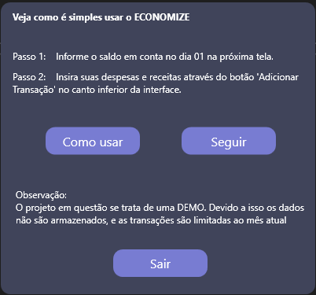
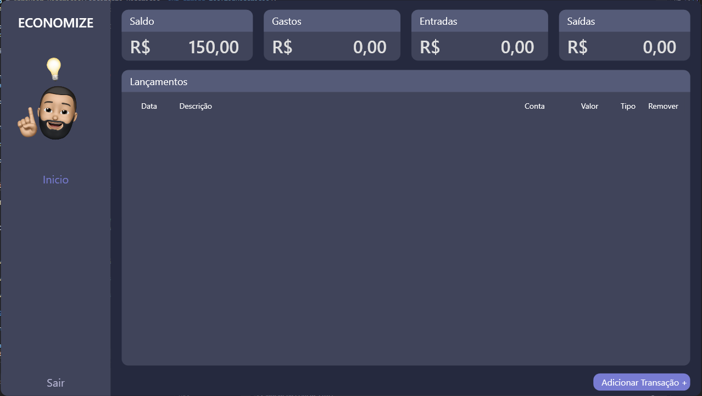
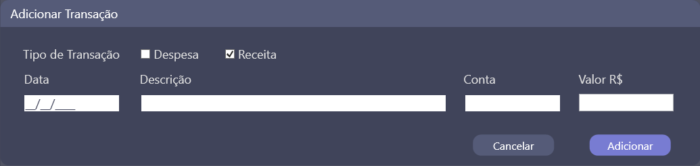
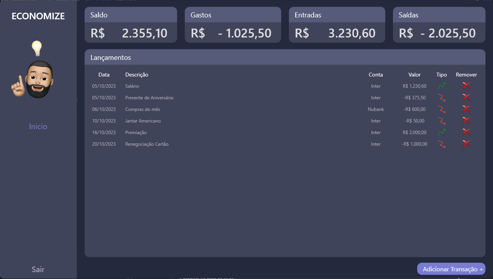

# ECONOMIZE

## Descrição

O Aplicativo Financeiro é uma ferramenta poderosa para ajudar você a gerenciar suas finanças pessoais e alcançar seus objetivos financeiros. Ele oferece recursos abrangentes para rastrear despesas, criar orçamentos, visualizar relatórios e muito mais.

## Funcionalidades

- Cálculo de Receitas
- Cálculo de Despesas
- Saldo Atual
- Adicionar / Atualizar / Remover Transações
- Projeção de entradas e saídas

## Capturas de Tela

## Como usar

1. Clone o repositório para o seu ambiente local:

git clone https://github.com/andrade-regis/ECONOMIZE

2. Navegue até o diretório do projeto:

cd E:\Público\ECONOMIZE\bin\Release\net7.0-windows

3. Abra o arquivo `ECONOMIZE.exe`.

4. Use a interface para organizar seu financeiro do mês.

## Contribuição

Contribuições são bem-vindas! Se você encontrar algum problema ou tiver sugestões de melhoria, abra uma issue ou envie um pull request.